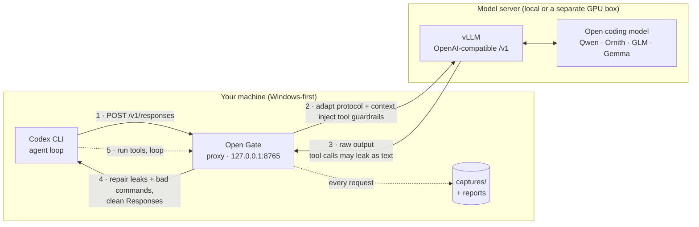

# Open Gate

<p align="center">
  
</p>

<p align="center">
  <strong>Make local open coding models behave inside Codex CLI.</strong>
</p>


Open coding models served through vLLM often emit tool calls as plain text (XML, JSON, Pythonic, fenced) instead of the structured calls Codex expects, and even when the wire format is clean the commands inside can be operationally broken. **Open Gate** is a small local proxy that sits between Codex CLI and your local model, repairs these failures on the fly, and measures everything — so a capable local model can do real Codex work instead of derailing on format.

With repair in front of a capable model, that has been enough to take a local model from leaking tool syntax to **shipping working, independently verified apps** through Codex (see [App-Build Results](#app-build-results)).

> Current release `0.7.0` · **zero runtime dependencies** (pure Python 3.11+ stdlib) · Windows-first. See `CHANGELOG.md` and `docs\release-process.md`.

## Quick Start

You need Python 3.11+, the Codex CLI, and a local OpenAI-compatible model server (e.g. vLLM) exposing `/v1`.

**1. Install** (no dependencies to pull):

```powershell
git clone https://github.com/stocklidevs/opengate
cd opengate
pip install -e .          # gives the `opengate` command — or skip and use `python -m open_gate`
```

**2. Point it at your model server.** Copy the example config and set the upstream endpoint:

```powershell
copy opengate.example.toml opengate.toml
notepad opengate.toml
```

```toml
[upstream]
scheme = "http"
host = "127.0.0.1"   # your local model server
port = 8001
path = "/v1"
model = "auto"        # autodetects whatever vLLM is serving
capability_probe = "auto"
```

**3. Run the proxy:**

```powershell
opengate
```

It starts on `http://127.0.0.1:8765`, autodetects the upstream model, and probes what protocol shapes the server accepts.

**4. Point Codex at Open Gate** with a temporary provider/profile:

```toml
[model_providers.open_gate]
name = "Open Gate"
base_url = "http://127.0.0.1:8765/v1"
wire_api = "responses"

[profiles.open_gate]
model_provider = "open_gate"
model = "open-gate-probe"
model_context_window = 32768
```

```powershell
codex --profile open_gate -C "C:\path\to\your\project"
```

That's it. Codex now talks to your local model through Open Gate, which repairs tool-call and command-quality failures as they happen.

## How It Works



Codex sends a Responses request; Open Gate adapts it, forwards to your model server, repairs the model's leaked tool calls and operationally-broken commands on the way back, and returns clean structured calls to Codex — capturing every exchange for reports. The model server can be on the same machine or a separate GPU box (e.g. an ASUS GX10).

Open Gate sits in the Codex ↔ vLLM path and does five things, in plain terms:

- **Repairs leaked tool calls.** Detects tool calls emitted as text (XML/JSON/Pythonic/fenced, plus GLM and DeepSeek dialects) and promotes them to the structured `tool_calls` Codex expects.
- **Cleans bad commands.** Catches structured calls that parse fine but would fail in practice (malformed PowerShell here-strings, nested `powershell.exe`, bare cmdlets, empty file writes) and repairs or quarantines them with actionable feedback.
- **Adapts the protocol.** Flattens multi-turn Responses history or unsupported roles when the upstream can't take the native shape — and stays out of the way (no-op) when it can, e.g. Responses-native servers.
- **Keeps the socket alive.** Emits real Responses heartbeat events while the model spends a minute producing a large tool call, so Codex doesn't see a silent stream.
- **Measures everything.** Writes every request to `captures/` (sensitive headers redacted) and produces repeatable benchmark reports you can compare against other backends.

It deliberately stops at protocol, tool-call format, and command quality. It does **not** steer task progress or repair model behavior.

Two modes: `repair` (return the cleaned response to Codex) and `observe` (return raw upstream output while recording what it *would* have fixed). Two context policies: `full` and `spoon` (compacts long histories, carries forward constraints from prior tool failures).

## App-Build Results

Tool-call cleanliness is necessary but not the goal; the goal is real software. The `fixtures/codex_live/software_build.json` suite asks the model to build small but real apps (a CSV expense CLI, a log-triage CLI, a single-file localStorage web app) and is judged by **independently executing the produced workspace**, never the model's self-report. Run through Open Gate `repair`:

| Model | Tier | software_build outcome | Notes |
| --- | --- | --- | --- |
| Gemma-4-E4B-IT | weak (~4B) | fabricated (1/3 files, claimed a working tool that did not exist) | only running the workspace caught the fabrication |
| Qwen3-Coder-Next | strong | shipped `expense_cli` (verified) | ships repair-off too, via Codex retry recovery |
| Ornith-1.0-35B (uncensored MoE) | strong MoE | **shipped all 3 apps + a correct Delaunay visualizer** | Responses-native, ~3-4x faster; see `docs\ornith.md` |

Takeaways: once Open Gate cleans the channel, **capability is the deciding variable** — capable models ship, the weak one fabricates. Channel repair is necessary, not sufficient, and its outcome value is largest for mid-capability models (a strong model self-recovers; a weak one fails regardless). For a Responses-native model like Ornith, Open Gate's translation job is a no-op, but its command-quality repair still earns its keep as a reliability/latency gate (repair-off runs thrash and time out). The Ornith Delaunay app's triangulation was verified correct out of band (Bowyer-Watson, zero empty-circumcircle violations across ~97k checks). Full detail in `docs\benchmark-notes.md` and `docs\ornith.md`.

The later `csvql_only` probe is harder than `software_build/expense_cli`: it asks for a small SQL engine, package, CLI, tests, README, and manual query verification. GLM-4.5-Air-NVFP4 is parked there: the endpoint and parser worked, but the best 64k run produced only CSV files plus an empty package marker. Kimi-Linear-48B-A3B-NVFP4 is parked earlier in the loop: native and flattened runs made zero tool calls and created zero files. MiniMax-M3-MXFP8 never reached the loop on the GX10 because model construction exhausted memory before `/v1/models` came up. Devstral-Small-2507 did enter the file-writing loop and landed a partial workspace, but the engine was syntactically broken and the CLI/tests were missing. Qwen3-Coder-Next through Qwen Code at 128k avoided the first context compression failure, but drifted into a different single-file demo and never produced the requested CSVQL package, fixtures, CLI, or tests. The shareable prompt, pass criteria, and verifier commands are in `docs\csvql-local-agent-challenge.md`. See `docs\glm-4-5-air-nvfp4.md`, `docs\kimi-linear-nvfp4.md`, `docs\minimax-m3-mxfp8.md`, `docs\devstral-small-2507.md`, and `docs\qwen3-coder-next.md`.

## Models

Per-model setup, repair evidence, and live status:

| Model | Status | Notes |
| --- | --- | --- |
| [Ornith-1.0-35B](docs/ornith.md) | **known-good (app gate)** | uncensored NVFP4 MoE, Responses-native, shipped the full app suite + Delaunay |
| [Qwen3-Coder-Next](docs/qwen3-coder-next.md) | known-good baseline; CSVQL unpassed | `43/60` → `60/60` repaired on the serious suite; Qwen Code 128k drifted on CSVQL |
| [GLM-4.7-Flash](docs/benchmark-notes.md) | repaired dialect | `2/20` → `20/20` repair/full |
| [GLM-4.5-Air-NVFP4](docs/glm-4-5-air-nvfp4.md) | parked (behavior) | tool probe passed; live CSVQL 131k/64k runs failed to create a runnable app |
| [Kimi-Linear-48B-A3B-NVFP4](docs/kimi-linear-nvfp4.md) | parked (tool interface) | plain Responses sanity passed; tool probes and live CSVQL produced no executable calls |
| [MiniMax-M3-MXFP8](docs/minimax-m3-mxfp8.md) | parked (deployment) | vLLM recognized the architecture, but 64k serving OOMed on the 119 GiB GX10 before an endpoint came up |
| [Devstral-Small-2507](docs/devstral-small-2507.md) | parked (behavior) | plain Responses and forced tools worked; live CSVQL write-file run produced broken Python and no CLI/tests |
| [DeepSeek-Coder-V2-Lite](docs/deepseek-coder-v2-lite.md) | parked (behavior) | `9/60` → `48/60` repaired; protocol-clean, behavior-limited |
| [Gemma-4-E4B-IT](docs/gemma-4-e4b-it.md) | parked (runtime) | smoke-clean; larger build gate failed with no artifacts |
| [Qwen3.6-27B](docs/qwen3-6-27b.md) | parked (protocol) | native Responses protocol issues |

Onboarding a new model: `docs\model-adaptation-checklist.md`. Full serving notes: `docs\vllm-notes.md`. Cross-model scorecard: `docs\benchmark-notes.md`.

---

## Advanced

The everyday flow above is all most users need. The sections below are reference for tuning, benchmarking, and development.

<details>
<summary><strong>Proxy modes, flags & configuration</strong></summary>

Run the proxy with explicit flags (e.g. spoon context for long interactive runs where history balloons and the model repeats failed tool paths):

```powershell
python -m open_gate `
  --upstream http://127.0.0.1:8001/v1 `
  --upstream-timeout 420 `
  --normalization-mode repair `
  --upstream-input-mode auto `
  --context-policy spoon `
  --context-max-chars 60000 `
  --context-recent-items 10 `
  --upstream-max-output-tokens 4096 `
  --instruction-policy auto `
  --tool-schema-policy auto
```

- `--normalization-mode` — `repair` (return cleaned output) or `observe` (return raw, record what it would fix).
- `--upstream-input-mode` — `auto` flattens Responses history/roles only when the upstream can't take the native shape; `native` forces native input.
- `--context-policy` — `spoon` compacts older history and keeps recent turns exact; see `docs\context-policy.md`.
- `--upstream-timeout` — give slower models time for large code-generation turns (default `420` s).
- `--upstream-max-output-tokens` — cap one upstream generation (default `4096`, `0` disables). Raise it for large single-file builds.
- `--write-file-tool` — inject a `write_file(path, content)` tool so the model writes files via JSON arguments instead of fragile shell here-strings; Open Gate translates each call into a robust base64 `shell` write before Codex sees it. Off by default; useful for local models that struggle writing large quote-heavy source files.
- `--stream-heartbeat-seconds` — Responses heartbeat cadence for streamed requests (default `2.0`).

Config precedence: `CLI flags > OPENGATE_CONFIG / local opengate.toml > built-in defaults`. Open Gate searches for `opengate.toml`, `open-gate.toml`, `.opengate.toml`, then `~\.opengate\config.toml`. Keep machine-specific endpoints in the ignored `opengate.toml`; commit nothing but `opengate.example.toml`. See `docs\upstream-capabilities.md` for capability probing and protocol adaptation.

Capture-only server (record Codex traffic without an upstream):

```powershell
python -m open_gate.server --host 127.0.0.1 --port 8765 --upstream-base-url ""
```

Lint a leak fixture or capture:

```powershell
python -m open_gate.lint fixtures\leaks\qwen_xml_tool_call.txt --tools fixtures\tools\codex_like_tools.json --pretty
```

Summarise the newest captured request:

```powershell
python -m open_gate.inspect_capture --pretty
```

</details>

<details>
<summary><strong>Benchmarking tool calls</strong></summary>

Run a raw baseline against your model server:

```powershell
python -m open_gate.benchmark --base-url http://127.0.0.1:8001/v1 --model Qwen3-Coder-Next --suite fixtures\benchmarks\codex_shell_smoke.json --runs 3 --label qwen_direct --output runs\qwen_direct.json
```

Harder leakage-bait and the broader serious suite:

```powershell
python -m open_gate.benchmark --base-url http://127.0.0.1:8001/v1 --model Qwen3-Coder-Next --suite fixtures\benchmarks\codex_tool_leak_stress.json --runs 3 --label qwen_direct_stress --output runs\qwen_direct_stress.json
python -m open_gate.benchmark --base-url http://127.0.0.1:8001/v1 --model Qwen3-Coder-Next --suite fixtures\benchmarks\qwen_serious_tool_stress.json --runs 3 --label qwen_direct_serious_r3 --output runs\qwen_direct_serious_r3.json --summary-only
```

Run the same benchmark through Open Gate proxy mode (starts a fresh proxy, verifies `/health`, refuses an occupied port, stores captures under `runs\<label>\captures`):

```powershell
powershell.exe -ExecutionPolicy Bypass -File .\scripts\run_proxy_benchmark.ps1
```

Headline numbers: direct Qwen scored `43/60` strict successes on the serious suite; the Open Gate proxy baseline scored `60/60`. Direct GLM-4.7-Flash scored `2/20` and leaked in `18/20`; `repair/full` brings it to `20/20`. Direct DeepSeek-Coder-V2-Lite `9/60` → `48/60` repaired (live behavior parked). Direct Gemma-4-E4B-IT `27/60`; smoke-clean after repairs but the larger build gate produced no artifacts. See `docs\benchmark-notes.md`.

Key summary fields: `strict_successes_rate`, `leaks_rate`, `argument_leaks_rate`, `proxy_recoverable_rate`, `missed_tool_calls_rate`, `invalid_tool_calls_rate`. `command_quality_issues_rate` is stricter than tool-call validity — it catches structured commands likely to fail inside Codex (executable-only calls, empty artifact writes, bare cmdlets, split `-Command` arrays, nested PowerShell, `&&`, malformed here-strings, full-page web fetches, brittle `python -c`).

```powershell
python -m open_gate.payload_probe --base-url http://127.0.0.1:8001/v1 --model Qwen3-Coder-Next
python -m open_gate.summarize_report runs\qwen_direct_serious_r3.json --pretty
```

</details>

<details>
<summary><strong>Live Codex benchmark (whole-agent runs)</strong></summary>

Run actual `codex exec` prompts through Open Gate:

```powershell
powershell.exe -ExecutionPolicy Bypass -File .\scripts\run_codex_live_benchmark.ps1 -Mode repair -Runs 3
powershell.exe -ExecutionPolicy Bypass -File .\scripts\run_codex_live_benchmark.ps1 -Mode repair -ContextPolicy spoon -Runs 3
powershell.exe -ExecutionPolicy Bypass -File .\scripts\run_codex_live_benchmark.ps1 -Mode observe -Runs 3 -Label codex_live_observe
```

For a constrained-context probe where the default output reserve would crowd the prompt, cap it explicitly:

```powershell
powershell.exe -ExecutionPolicy Bypass -File .\scripts\run_codex_live_benchmark.ps1 -Suite fixtures\codex_live\csvql_only.json -Mode repair -ModelContextWindow 65536 -UpstreamMaxOutputTokens 16384
```

The software-build stress suite with a disposable working folder:

```powershell
powershell.exe -ExecutionPolicy Bypass -File .\scripts\run_codex_live_benchmark.ps1 -Model ornith -Suite fixtures\codex_live\software_build.json -CodexCwd C:\path\to\disposable -Mode repair -ContextPolicy spoon -Sandbox workspace-write -FailOnPromptSandboxMismatch -Runs 1 -Label ornith_software_build
```

Summarise an existing live run:

```powershell
python -m open_gate.codex_report runs\codex-live\<run-id>\captures --codex-dir runs\codex-live\<run-id> --pretty --summary-only
```

Details in `docs\live-codex-benchmark.md`. Latest small smoke:

| Metric | Repair | Observe |
| --- | ---: | ---: |
| Codex turns completed | 3/3 | 3/3 |
| Policy-blocked Codex runs | 0 | 1 |
| Returned command-quality issues | 0 | 1 |
| Returned invalid tool calls | 0 | 1 |
| Returned clean capture rate | 100% | 42.86% |

</details>

<details>
<summary><strong>Capture regressions & verification</strong></summary>

Turn a proxy capture into a replayable fixture, then replay all fixtures:

```powershell
python -m open_gate.capture_to_fixture captures\<capture>.json --name <fixture-name>
python -m open_gate.regression --pretty
```

See `docs\regression-workflow.md`. Run the test suite and adversarial fuzzer:

```powershell
python -m unittest discover -s tests
python -m open_gate.adversarial --iterations 300 --seed 6047
python -m open_gate.regression --pretty
```

For pre-release or model-adaptation work, the looped local gate:

```powershell
powershell.exe -ExecutionPolicy Bypass -File .\scripts\run_validation_loop.ps1 -Loops 3 -AdversarialIterations 300
```

</details>

<details>
<summary><strong>Full feature reference</strong></summary>

- `opengate` starts the local proxy using `opengate.toml`, CLI overrides, and model autodetection.
- `open_gate.server` runs a fake `/v1/responses` and `/v1/chat/completions` server.
- `open_gate.server --upstream-base-url ...` or `python -m open_gate --upstream ...` runs buffered-upstream `/v1/responses` proxy mode.
- Proxy mode autodetects the active upstream model from `GET /v1/models` when `model = "auto"`, and rewrites Codex's forwarded `model` field to that detected upstream model.
- Proxy mode probes upstream protocol capabilities, including `developer` role and native tool-history support, then adapts Responses input before vLLM rejects it.
- Proxy mode supports `--normalization-mode repair` and `--normalization-mode observe`.
- `--upstream-input-mode auto` flattens multi-turn Codex Responses history or unsupported instruction roles when vLLM cannot accept the native shape.
- `--context-policy spoon` compacts older Codex history, keeps recent turns exact, and carries forward concise constraints from prior tool failures.
- Command quality catches malformed PowerShell file-content syntax such as placeholder here-string markers before Codex executes the bad command.
- `--upstream-max-output-tokens` (default `4096`) prevents a single local-model turn from growing into a giant artifact generation that times out before Codex sees a tool call.
- OpenGate keeps its default scope to protocol adaptation, tool-call repair, command-quality quarantine, captures, and reporting; it does not try to manage task progress.
- Proxy mode strips generic `<channel|>` assistant prefaces when a final non-empty answer suffix is present, and records the repair in live reports.
- OpenGate-generated diagnostics prefer a safe `shell` observation when shell is available, so they do not show up as model-authored `update_plan` items.
- Proxy mode injects compact tool-discipline guardrails before upstream generation, including the exact callable tool list and explicit warnings against invented aliases such as `browser`, `write_file`, and `apply_patch`.
- Proxy mode quarantines structured shell calls with command-quality errors into safe diagnostic shell calls, so Codex receives actionable tool feedback instead of only assistant prose.
- Proxy mode blocks shell calls that only invoke `powershell.exe`, `pwsh`, or `cmd` without a real script, and strips approval metadata from diagnostic shell quarantines.
- Proxy mode treats Codex `web_search` as a hosted tool, converting model-returned URL lookups into bounded shell metadata fetches when `shell` is available.
- Proxy mode defaults to request-diet `auto` policies, digesting oversized Codex instructions and compacting oversized tool schemas before forwarding to vLLM.
- Streamed proxy requests emit real Responses lifecycle/heartbeat events while waiting for vLLM, then replay the normalized response as Responses SSE events.
- Every request is written to `captures/` with sensitive headers redacted.
- `open_gate.linter` extracts leaked tool calls from XML tags, GLM `<arg_key>/<arg_value>` tags, DeepSeek/vLLM delimiter blocks, Kimi reserved-token blocks, bare `recipient_name=functions.*` headers, JSON tool-call arrays, fenced JSON, and Pythonic `functions.tool({...})` calls.
- `open_gate.command_quality` detects structured tool calls that parse as JSON but are likely to fail inside Codex (executable-only calls, empty artifact writes, bare PowerShell cmdlets/aliases, split `-Command` arrays, nested PowerShell, Windows PowerShell `&&`, bad here-strings, malformed JSON-array scripts, fragile Python one-liners, full-page web fetches, non-image `view_image` paths).
- With `--write-file-tool`, Open Gate injects an optional `write_file(path, content)` tool into the upstream request, advertises it in the guardrail, and translates each returned call into a robust base64 `shell` write — so local models can write files via JSON args while Codex still only sees `shell`.
- `open_gate.regression` replays captured upstream responses through normalization as stable fixtures.
- `open_gate.adversarial` fuzzes malformed GLM-style tag whitespace through the full proxy normalizer to catch leakage slips before live Codex runs.
- `open_gate.codex_report` summarizes live Codex JSONL output and proxy captures.
- `open_gate.benchmark` writes partial reports as each case finishes and separates protocol incompatibilities from model/tool-call behavior.
- Fixtures in `fixtures/leaks/` model common bad outputs from open-model tool-call formats.

</details>

## Versioning

Open Gate uses semantic versioning before `1.0`. Keep `VERSION`, `pyproject.toml`, and `open_gate\version.py` in sync. The current version is `0.7.0`.

## Roadmap

Ornith-1.0-35B is the first model marked known-good on the live `software_build` app gate (Responses-native, shipped all three apps plus a correct Delaunay visualizer, ~3-4x faster than Qwen). Open follow-ups: a `Runs 3` per-isolated re-run to firm up Ornith's single-sample suite numbers, and a Qwen full-suite comparison. Qwen3.6-27B, DeepSeek-Coder-V2-Lite, and Gemma-4-E4B-IT remain parked behavior/runtime-limited targets.
