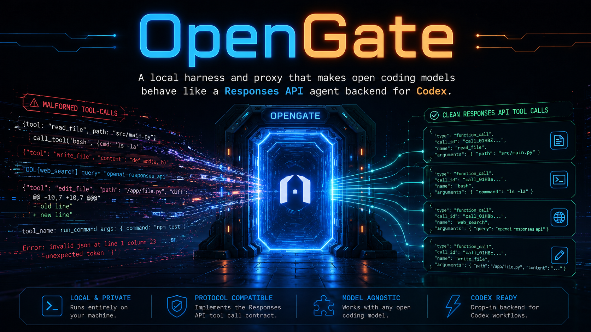

# Open Gate

<p align="center">
  
</p>

<p align="center">
  <strong>Make local open coding models behave inside Codex CLI.</strong>
</p>


Open Gate is a local harness and proxy for making open coding models behave like a Responses API agent backend for Codex. It captures real Codex traffic, detects tool-call leakage, repairs common open-model tool-call failures, and produces repeatable baseline reports that other home-lab users can compare.

Current release: `0.6.7`. See `CHANGELOG.md` for release notes and `docs\release-process.md` for versioning.

## Current Shape

- `opengate` starts the local proxy using `opengate.toml`, CLI overrides, and model autodetection.
- `open_gate.server` runs a fake `/v1/responses` and `/v1/chat/completions` server.
- `open_gate.server --upstream-base-url ...` or `python -m open_gate --upstream ...` runs buffered-upstream `/v1/responses` proxy mode.
- Proxy mode autodetects the active upstream model from `GET /v1/models` when `model = "auto"`, and rewrites Codex's forwarded `model` field to that detected upstream model.
- Startup prints the OpenGate version, listener URL, active flags, descriptions, and current values.
- Proxy mode supports `--normalization-mode repair` and `--normalization-mode observe`.
- Proxy mode defaults to `--upstream-input-mode auto`, which flattens multi-turn Codex Responses history when vLLM rejects native item types.
- Proxy mode supports `--context-policy spoon`, which compacts older Codex history, keeps recent turns exact, and carries forward concise constraints from prior tool failures.
- Proxy mode injects compact tool-discipline guardrails before upstream generation, including the exact callable tool list and explicit warnings against invented aliases such as `web_search`, `write_file`, and `apply_patch`.
- Proxy mode defaults to request-diet `auto` policies, digesting oversized Codex instructions and compacting oversized tool schemas before forwarding to vLLM.
- Streamed proxy requests emit real Responses lifecycle/heartbeat events while waiting for vLLM, then replay the normalized response as Responses SSE events.
- Every request is written to `captures/` with sensitive headers redacted.
- `open_gate.linter` extracts leaked tool calls from XML tags, GLM `<arg_key>/<arg_value>` tags, bare `recipient_name=functions.*` headers, JSON tool-call arrays, fenced JSON, and Pythonic `functions.tool({...})` calls.
- `open_gate.command_quality` detects structured tool calls that parse as JSON but are likely to fail inside Codex, including empty artifact writes, bare PowerShell cmdlets, split PowerShell `-Command` arrays, nested PowerShell, Windows PowerShell `&&`, bad here-strings, bare here-string file writes, malformed JSON-array PowerShell scripts, fragile Python one-liners, full-page web fetches, and non-image `view_image` paths.
- `open_gate.regression` replays captured upstream responses through normalization as stable fixtures.
- `open_gate.adversarial` fuzzes malformed GLM-style tag whitespace through the full proxy normalizer to catch leakage slips before live Codex runs.
- `open_gate.codex_report` summarizes live Codex JSONL output and proxy captures.
- Fixtures in `fixtures/leaks/` model common bad outputs from open-model tool-call formats.

## Quick Start

```powershell
copy opengate.example.toml opengate.toml
notepad opengate.toml
opengate
```

For the current GLM/Qwen home-lab setup, the local ignored `opengate.toml` can point at:

```toml
[upstream]
scheme = "http"
host = "127.0.0.1"
port = 8001
path = "/v1"
model = "auto"
```

When `model = "auto"`, OpenGate asks the upstream server for `GET /v1/models` at launch. Codex can keep pointing at OpenGate; OpenGate maps whatever Codex requested to the detected model currently served by vLLM.

The older commands still work:

```powershell
open-gate --upstream http://127.0.0.1:8001/v1 --context-policy spoon
python -m open_gate --upstream http://127.0.0.1:8001/v1 --normalization-mode observe
```

## Run The Capture Server

```powershell
python -m open_gate.server --host 127.0.0.1 --port 8765 --upstream-base-url ""
```

Use `--upstream-input-mode native` only when the upstream server fully supports Codex-style multi-turn Responses input. vLLM may reject assistant history, function-call items, or tool-output items unless Open Gate flattens that history first.

Use `--context-policy spoon` for long interactive Codex runs where the history can balloon and the model may repeat failed tool paths:

```powershell
python -m open_gate `
  --upstream http://127.0.0.1:8001/v1 `
  --upstream-timeout 420 `
  --normalization-mode repair `
  --upstream-input-mode auto `
  --context-policy spoon `
  --context-max-chars 60000 `
  --context-recent-items 10 `
  --instruction-policy auto `
  --tool-schema-policy auto
```

See `docs\context-policy.md` for the spoon-feed compiler and its capture metrics.

Use `--upstream-timeout` to give slower local models enough time for large code-generation turns. The CLI default is `420` seconds. Use `--stream-heartbeat-seconds` to tune Responses heartbeat events for streamed Codex requests. The default is `2.0`, which keeps Codex from seeing a silent socket while Qwen/GLM/vLLM spends a minute or more producing a large tool call.

Config precedence is:

```text
CLI flags > OPENGATE_CONFIG / local opengate.toml > built-in defaults
```

OpenGate searches for `opengate.toml`, `open-gate.toml`, `.opengate.toml`, then `~\.opengate\config.toml`. Use `opengate.example.toml` as the public template and keep machine-specific endpoints in ignored `opengate.toml`.

Use a temporary Codex provider/profile that points at `http://127.0.0.1:8765/v1` with `wire_api = "responses"`. Your current real model endpoint can stay as:

```toml
[model_providers.qwen_local]
name = "Qwen3-Coder-Next via vLLM"
base_url = "http://127.0.0.1:8001/v1"
wire_api = "responses"
```

For capture-only probing, use a local provider like:

```toml
[model_providers.open_gate_capture]
name = "Open Gate capture"
base_url = "http://127.0.0.1:8765/v1"
wire_api = "responses"

[profiles.open_gate_capture]
model_provider = "open_gate_capture"
model = "open-gate-probe"
model_context_window = 32768
model_supports_reasoning_summaries = false
```

Then run:

```powershell
codex --profile open_gate_capture -C "C:\Users\example\source\repos\glm-test"
```

In this sandboxed harness, detached background processes can be cleaned up between commands. The probe scripts keep the server alive only for the duration of the request:

```powershell
powershell.exe -ExecutionPolicy Bypass -File C:\Users\example\source\repos\open-gate\scripts\run_http_probe.ps1
powershell.exe -ExecutionPolicy Bypass -File C:\Users\example\source\repos\open-gate\scripts\run_codex_capture_probe.ps1
```

Summarise the newest captured request:

```powershell
python -m open_gate.inspect_capture --pretty
```

## Lint A Fixture

```powershell
python -m open_gate.lint fixtures\leaks\qwen_xml_tool_call.txt --tools fixtures\tools\codex_like_tools.json --pretty
```

The lint output includes `command_quality_issues` for tool calls that are syntactically structured but operationally suspicious. This catches failures like `cd glm-test && ...` under Windows PowerShell, full-page `Invoke-WebRequest` HTML dumps, `uv run playwright ...` before Playwright is installed, or `view_image` pointed at a directory. See `docs\tool-call-linter.md`.

## Benchmark Tool Calls

The Qwen baseline used vLLM serving `cyankiwi/Qwen3-Coder-Next-AWQ-4bit` as `Qwen3-Coder-Next`. The first GLM baseline used `zai-org/GLM-4.7-Flash` as `GLM-4.7-Flash`. Full setup notes are in `docs\vllm-notes.md`.

Run a raw baseline against the GX10 vLLM server:

```powershell
python -m open_gate.benchmark --base-url http://127.0.0.1:8001/v1 --model Qwen3-Coder-Next --suite fixtures\benchmarks\codex_shell_smoke.json --runs 3 --label qwen_direct --output runs\qwen_direct.json
```

Run a harder leakage-bait suite:

```powershell
python -m open_gate.benchmark --base-url http://127.0.0.1:8001/v1 --model Qwen3-Coder-Next --suite fixtures\benchmarks\codex_tool_leak_stress.json --runs 3 --label qwen_direct_stress --output runs\qwen_direct_stress.json
```

Run the broader serious baseline:

```powershell
python -m open_gate.benchmark --base-url http://127.0.0.1:8001/v1 --model Qwen3-Coder-Next --suite fixtures\benchmarks\qwen_serious_tool_stress.json --runs 3 --label qwen_direct_serious_r3 --output runs\qwen_direct_serious_r3.json --summary-only
```

Run the same benchmark through Open Gate proxy mode:

```powershell
powershell.exe -ExecutionPolicy Bypass -File C:\Users\example\source\repos\open-gate\scripts\run_proxy_benchmark.ps1
```

The proxy benchmark runner starts a fresh local Open Gate process, verifies `/health` metadata for the requested model and context policy, refuses to reuse an occupied port, and stores captures under `runs\<label>\captures`.

Direct Qwen scored `43/60` strict successes on the serious suite. The first Open Gate proxy baseline scored `60/60` on the same suite. Direct GLM-4.7-Flash scored `2/20` strict successes on the first serious baseline and leaked tool syntax in `18/20` cases. Open Gate `0.6.0` repairs that GLM dialect: `repair/full` scored `20/20`, and `repair/spoon` scored `19/20` with zero leaks. See `docs\benchmark-notes.md`.

For interactive Codex usage, see `docs\interactive-codex.md`.

The key summary fields are `strict_successes_rate`, `leaks_rate`, `argument_leaks_rate`, `proxy_recoverable_rate`, `missed_tool_calls_rate`, and `invalid_tool_calls_rate`. A leaked but parseable tool call is counted as a failure for the raw backend and as `proxy_recoverable`, which is the number Open Gate should drive toward a structured success.

`command_quality_issues_rate` is stricter than basic tool-call validity. It catches structured commands that are likely to fail inside Codex even though they parse as valid JSON, such as empty target artifact writes, bare PowerShell cmdlets (`Write-Host` as the executable), split `powershell.exe -Command` arrays, nested PowerShell, Windows PowerShell `&&`, malformed here-strings, full-page web fetches, and brittle `python -c` compound statements.

Probe request-size behavior without generation:

```powershell
python -m open_gate.payload_probe --base-url http://127.0.0.1:8001/v1 --model Qwen3-Coder-Next
```

Summarise a benchmark report by category and case:

```powershell
python -m open_gate.summarize_report runs\qwen_direct_serious_r3.json --pretty
```

Observed local results are recorded in `docs\benchmark-notes.md` and `docs\vllm-notes.md`.

## Live Codex Benchmark

Run actual `codex exec` prompts through Open Gate:

```powershell
powershell.exe -ExecutionPolicy Bypass -File .\scripts\run_codex_live_benchmark.ps1 -Mode repair -Runs 3
```

Run the same live harness with the spoon-feed context compiler:

```powershell
powershell.exe -ExecutionPolicy Bypass -File .\scripts\run_codex_live_benchmark.ps1 -Mode repair -ContextPolicy spoon -Runs 3
```

Run the same suite in raw-observation mode:

```powershell
powershell.exe -ExecutionPolicy Bypass -File .\scripts\run_codex_live_benchmark.ps1 -Mode observe -Runs 3 -Label codex_live_observe
```

Run the software-build stress suite with a disposable working folder and fail fast if Codex shows the model the wrong sandbox:

```powershell
powershell.exe -ExecutionPolicy Bypass -File .\scripts\run_codex_live_benchmark.ps1 -Model GLM-4.7-Flash -Suite fixtures\codex_live\software_build.json -CodexCwd C:\Users\example\source\repos\glm-live-software -Mode repair -ContextPolicy spoon -Sandbox workspace-write -FailOnPromptSandboxMismatch -Runs 1 -Label glm47_software_build
```

Summarise an existing live run:

```powershell
python -m open_gate.codex_report runs\codex-live\<run-id>\captures --codex-dir runs\codex-live\<run-id> --pretty --summary-only
```

Live benchmark details are in `docs\live-codex-benchmark.md`. The first known-good Qwen compatibility note is in `docs\qwen3-coder-next.md`, and the repeatable process for the next model is in `docs\model-adaptation-checklist.md`.

Latest local smoke result:

| Metric | Repair | Observe |
| --- | ---: | ---: |
| Codex turns completed | 3/3 | 3/3 |
| Policy-blocked Codex runs | 0 | 1 |
| Returned command-quality issues | 0 | 1 |
| Returned invalid tool calls | 0 | 1 |
| Returned clean capture rate | 100% | 42.86% |

## Capture Regressions

Turn a proxy capture into a replayable fixture:

```powershell
python -m open_gate.capture_to_fixture captures\20260509-123610-677429-proxy-c9b21604.json --name qwen_nested_powershell_20260509
```

Replay all regression fixtures:

```powershell
python -m open_gate.regression --pretty
```

The first real fixture locks in the nested PowerShell repair seen during interactive Codex smoke testing. See `docs\regression-workflow.md`.

## Verify

```powershell
python -m unittest discover -s tests
python -m open_gate.adversarial --iterations 300 --seed 6047
python -m open_gate.regression --pretty
```

For pre-release or model-adaptation work, run the looped local gate:

```powershell
powershell.exe -ExecutionPolicy Bypass -File .\scripts\run_validation_loop.ps1 -Loops 3 -AdversarialIterations 300
```

The first Codex capture showed `POST /v1/responses` with `stream: true`, three input messages, and ten tools. See `docs/codex-capture-notes.md`.

## Versioning

Open Gate uses semantic versioning before `1.0`. Keep `VERSION`, `pyproject.toml`, and `open_gate\version.py` in sync. The current version is `0.6.7`.

## Next Milestone

The next step is to adapt a third model with the same process: direct baseline, observe capture, repair benchmark, then add only model-agnostic recovery rules when the captures prove a repeatable failure shape.
